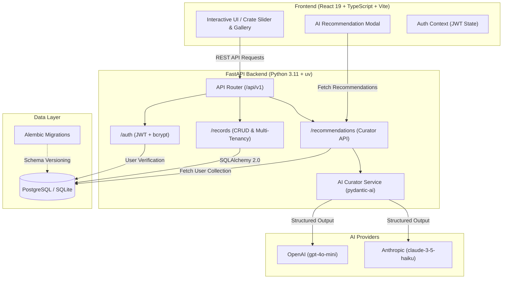

# 🎵 Vinyl Crate — AI-Powered Full-Stack Vinyl Collection Platform

[](https://www.python.org/)
[](https://fastapi.tiangolo.com/)
[](https://astral.sh/uv)
[](https://ai.pydantic.dev/)
[](https://react.dev/)
[](https://www.typescriptlang.org/)
[](https://tailwindcss.com/)
[](https://docs.pytest.org/)
[](https://mypy-lang.org/)
[](https://github.com/)

A modern, production-grade full-stack web application designed for audiophile vinyl collectors. Features an **AI-powered record curator** using **Pydantic-AI**, an interactive **vinyl crate slider & gallery browsing experience**, multi-tenant JWT security, automated database migrations, and blazing fast tooling powered by **`uv`**, **Ruff**, and **React 19**.

---

## 🌟 Key Highlights & Engineering Features



### 🤖 1. AI Vinyl Curator: "What to Spin Next"
- **Powered by `pydantic-ai`**: Built on Pydantic's official agent framework for strictly validated, type-safe structured outputs.
- **Context-Aware Analysis**: Dynamically analyzes the collector's database archive (artists, eras, genres, condition grades, valuation) to suggest 3 complementary pressings to acquire next.
- **Rich Audiophile Reasoning**: Provides historical context, sonic pairing rationale, estimated market prices, and target Goldmine condition grades.
- **1-Click Crate Addition**: Collectors can instantly add any recommended album directly into their personal collection from the recommendation card.
- **Multi-Provider Support**: Pluggable support for **OpenAI** (`gpt-4o-mini`), **Anthropic** (`claude-3-5-haiku`), or offline curated starter fallback.

### 🎛️ 2. Interactive Vinyl Crate Slider & Gallery Views
- **Tactile Sleeve Slider**: Browse albums smoothly with keyboard navigation, gesture dragging, and responsive sleeve transitions.
- **Spinning Vinyl Disc Animations**: Dynamic sliding vinyl discs on hover with realistic vinyl grooves and label details.
- **Dual-Mode Switcher**: Effortlessly switch between interactive **Slider Crate** view and dense **Grid Gallery** view.
- **Live Crate Analytics**: Real-time stats banner displaying total portfolio valuation, disc count, average album price, and pressing era span.

### 🛡️ 3. Security, Multi-Tenancy & Performance
- **Multi-Tenant Privacy**: Queries and collections are strictly isolated per authenticated collector (`user_id`).
- **Stateless Authentication**: OAuth2 Bearer password flow with salted **bcrypt** password hashing and **PyJWT**.
- **Database Versioning**: Production database migrations managed with **Alembic** (batch mode enabled for SQLite & PostgreSQL compatibility).
- **Latency Observability**: High-precision `X-Process-Time` response headers with structured access logging.

### 🧪 4. Enterprise Quality & CI/CD Pipeline
- **Lightning Package Management**: **`uv`** (Astral) for 10x–100x faster dependency installation and virtualenv management.
- **Unified Package Standard**: PEP 621 compliant `pyproject.toml`.
- **Ruff**: Ultra-fast linting and automatic code formatting.
- **Mypy**: Static compile-time type verification across all backend modules.
- **Pytest Suite**: 21 unit & integration tests with **93% code coverage** and isolated in-memory test database fixtures.
- **Automated GitHub Actions CI**:
  - ⚡ **`astral-sh/setup-uv`**: Ultra-fast containerized Python environment provisioning.
  - 🔑 **Gitleaks**: Automated secret scanning to prevent credential leakage.
  - 📦 **pip-audit**: Dependency vulnerability auditing against PyPA and OSV advisories.
  - 🏷️ **Mypy & Ruff**: Code quality enforcement.
  - 🧪 **Pytest**: Backend unit & integration test validation.
  - ⚛️ **Frontend Build**: TypeScript typecheck and Vite production build.

---

## ⚡ Quick Start with `make`

The repository includes a self-documenting [`Makefile`](./Makefile) that automates common developer tasks with automatic `uv` detection:

```bash
# 🛠️ 1. Setup & install backend (via uv) and frontend dependencies
make install

# 🚀 2. Start FastAPI backend (hot-reload at http://localhost:8000)
make dev

# 🎨 3. Start React frontend (Vite at http://localhost:5173)
make frontend

# 🧪 4. Run test suite with full coverage report
make test
make coverage

# ✨ 5. Lint, auto-format, and static typecheck
make format
make typecheck

# 🔒 6. Run dependency vulnerability audit
make audit

# 🗄️ 7. Apply database migrations
make migrate

# 🐳 8. Launch full stack via Docker Compose (PostgreSQL + FastAPI + React)
make docker-up
```

---

## 🚀 Getting Started (Manual Commands)

### Option A: 1-Command Launch with Docker Compose

```bash
docker compose up --build
```
- **Frontend App**: [http://localhost:5173](http://localhost:5173)
- **Backend API**: [http://localhost:8000](http://localhost:8000)
- **Interactive Swagger Docs**: [http://localhost:8000/docs](http://localhost:8000/docs)

---

### Option B: Local Development with `uv`

#### 1. Backend Setup (FastAPI):
```bash
# Create virtual environment with uv
uv venv .venv
source .venv/bin/activate

# Install dependencies in milliseconds
uv pip install -e ".[dev]"

# (Optional) Add your AI provider key in .env:
# OPENAI_API_KEY=sk-...

# (Optional) Add your AI provider key in .env:
# OPENAI_API_KEY=sk-...

# Start backend server
uvicorn main:app --reload
```

#### 2. Frontend Setup (React + Vite):
In a separate terminal:
```bash
cd frontend
npm install
npm run dev
```

---

## 🧪 Testing & Verification

```bash
# Run unit & integration tests
pytest -v

# Run with test coverage report
pytest --cov=app --cov-report=term-missing tests/

# Check and auto-format code
ruff check --fix app/ tests/
ruff format app/ tests/

# Run Mypy static type checker
mypy app/
```

---

## 🔑 Demo Credentials

- **Username**: `vinyl_fan`
- **Email**: `collector@crate.com`
- **Password**: `secretpassword123`

*(You can also use the one-click **"Click for Instant Demo Login"** button directly in the UI)*.
